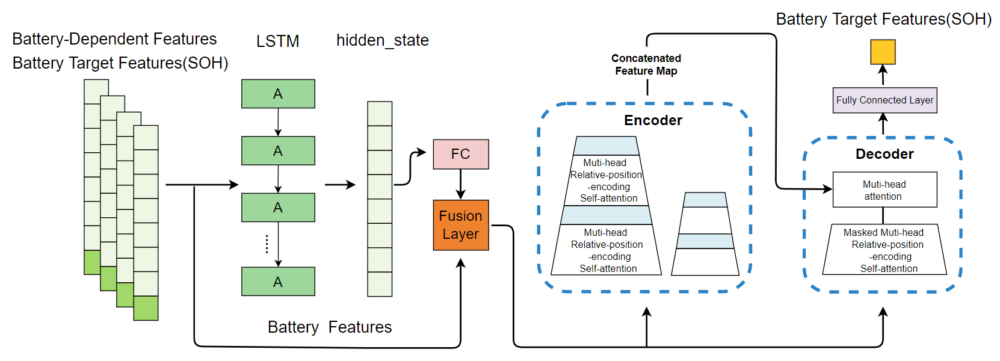

# Data-Driven Ultra-Long-Term Early Prediction of Lithium-Ion Battery State of Health Under Different Charge-Discharge Strategies

This is a PyTorch implementation of LRPEformer model and discussion experiments proposed by our paper "Data-Driven Ultra-Long-Term Early Prediction of Lithium-Ion Battery State of Health Under Different Charge-Discharge Strategies".

## 1.Overview

Fig.1 An overview of LRPEformer model.

Our study presents an Ultra-Long-Term Early Prediction model, LRPEformer (LSTM Relative Position Encoding Informer), to predict battery State of Health and significantly reduce the time cost of experiments. We perform unified sequence modeling for lithium-ion batteries under various charge-discharge strategies.We introduce complex temporal feature extraction and optimize the formula for calculating attention scores, effectively modeling ultra-long and complex temporal information. We also propose a two-stage training method, modeling and predicting dependent features and target features separately, reducing error accumulation during iterative prediction.


## 2.Requirements
- pyecharts==2.0.3
- matplotlib==3.5.1
- numpy==1.21.5
- pandas==1.3.5
- scikit-learn==1.0.2
- torch==1.7.1
- ....

You can install it directly from the environment pack version file:
```
pip install -r requirements.txt
or
conda env create -f torch_lts.yaml
```

## 3.Data
You can find the processed data for this work in the data folder, or obtain the original data from the following table using the reference URL.
| Data Source       | Description           | Reference URL                  |
| ----------------- | --------------------- | ------------------------------ |
| Nature Battery    | The objective of this work is to optimize fast charging for lithium-ion batteries .| /data/processed_data.csv      |


